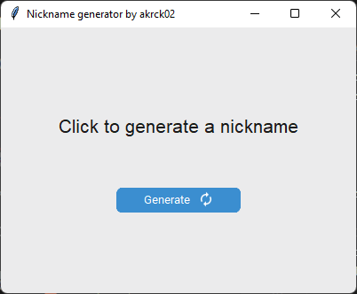
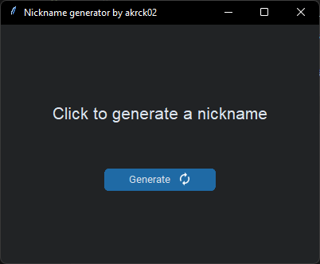
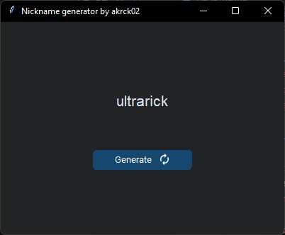

# Nickname generator

Hi there, This is a simple program that generates a random nickname for you. Its based on the [nickname file by @onyxrev](https://github.com/onyxrev/common_nickname_csv/).

I added some suffix and prefix files and random appendage to the nicknames so that you can have a more random nickname.

I will be updating this program whenever I get a chance to, so please check back often. This is a little project compared to the other ones I have been working on GitHub.

 

# Usage
To use this program, you need to install the following dependencies:

    - python
    - pip

## Windows 
Run the cmd/win/dependencies.bat file to install the python dependencies.
and then run the program with the start.win.bat file.

## Linux
Run the cmd/linux/dependencies.sh file to install the python dependencies.
and then run the program with the start.linux.sh file.

 

# Thanks to 

-  [@onyxrev](https://github.com/onyxrev) for the nickname file 